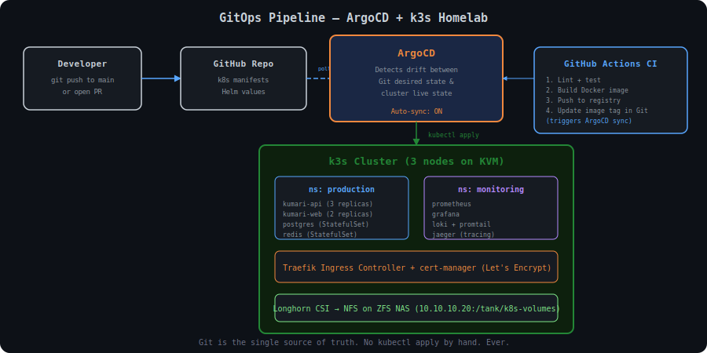

# GitOps on My Homelab: How ArgoCD and k3s Replaced My kubectl Habits

Setting up a proper GitOps pipeline with ArgoCD on a k3s cluster running on KVM, deploying Kumari.ai's staging environment, and why I'll never kubectl apply -f by hand again.

## Architecture

## Background

I deleted my staging environment. Not on purpose. Not gracefully. I ran `kubectl delete namespace kumari-staging` at 2 AM while I meant to target `kumari-staging-old`. There was no confirmation prompt. There was no undo button. One second the namespace existed with its Deployments, Services, ConfigMaps, Secrets, and PVCs — the next second, gone. Kubernetes doesn't have a recycle bin.

I sat there staring at my terminal, knowing I had no reliable way to reconstruct the exact state of that namespace. Sure, I had YAML files scattered across three directories on my workstation. Some were current. Some were from two months ago. Some had been hand-edited with `kubectl edit` and never saved back to a file. The manifests on disk didn't match what was running in the cluster, and I had no way to know what the delta was because the running state was now deleted.

## Topics

`Kubernetes` · `GitOps` · `ArgoCD` · `k3s` · `Homelab` · `DevOps` · `Helm`

## Repo contents

Artifacts and configs from the build:

- **.github/workflows/.github/workflows/** — validate-image-tags.yml
- **kubernetes/apps/** — kumari-staging.yaml, monitoring.yaml, root.yaml
- **kubernetes/argocd/** — repo-secret.yaml
- **kubernetes/base/kumari-backend/** — deployment.yaml
- **kubernetes/base/postgres/** — statefulset.yaml
- **kubernetes/base/redis/** — deployment.yaml
- **kubernetes/overlays/staging/** — kustomization.yaml, ingress.yaml
- **kubernetes/overlays/staging/patches/** — replica-count.yaml, backend-resources.yaml
- **kubernetes/overlays/staging/secrets/** — sealed-secrets.yaml
- **scripts/** — script.sh, script-2.sh, script-3.sh, script-4.sh, script-5.sh, script-6.sh, script-7.sh, script-8.sh, script-9.sh, script-10.sh, script-11.sh, script-12.sh, script-13.sh, script-14.sh, script-15.sh, script-16.sh, script-17.sh, script-18.sh, script-19.sh, script-20.sh, script-21.sh, script-22.sh, script-23.sh

## Read the full write-up

[reshamchaudhary.com/homelab/gitops-argocd-k3s-homelab](https://reshamchaudhary.com/homelab/gitops-argocd-k3s-homelab)

The blog post has the full walkthrough — the design decisions, debugging stories, performance numbers, and the lessons that didn't make it into the configs.
